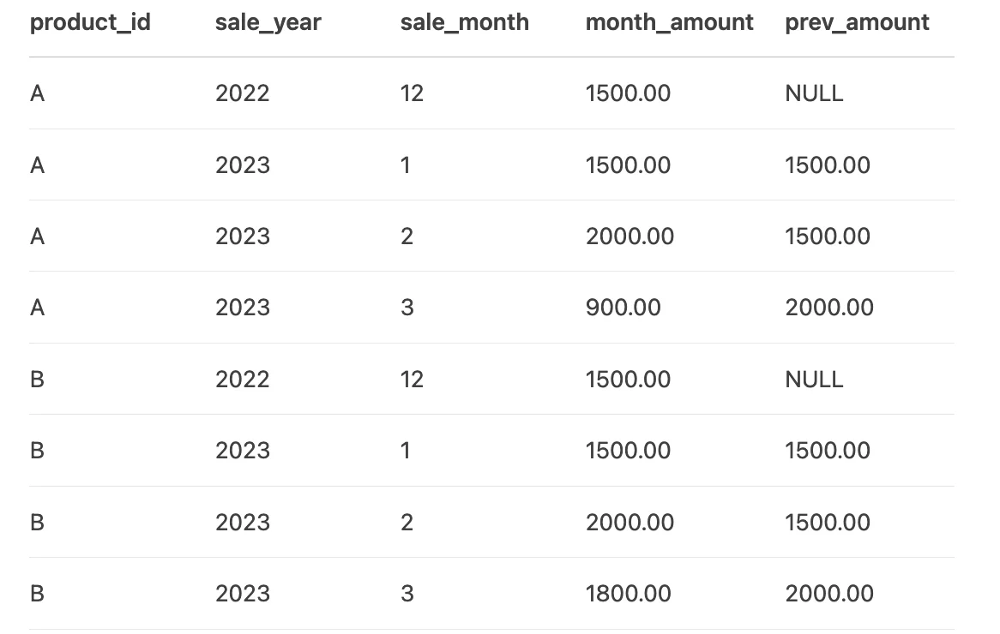
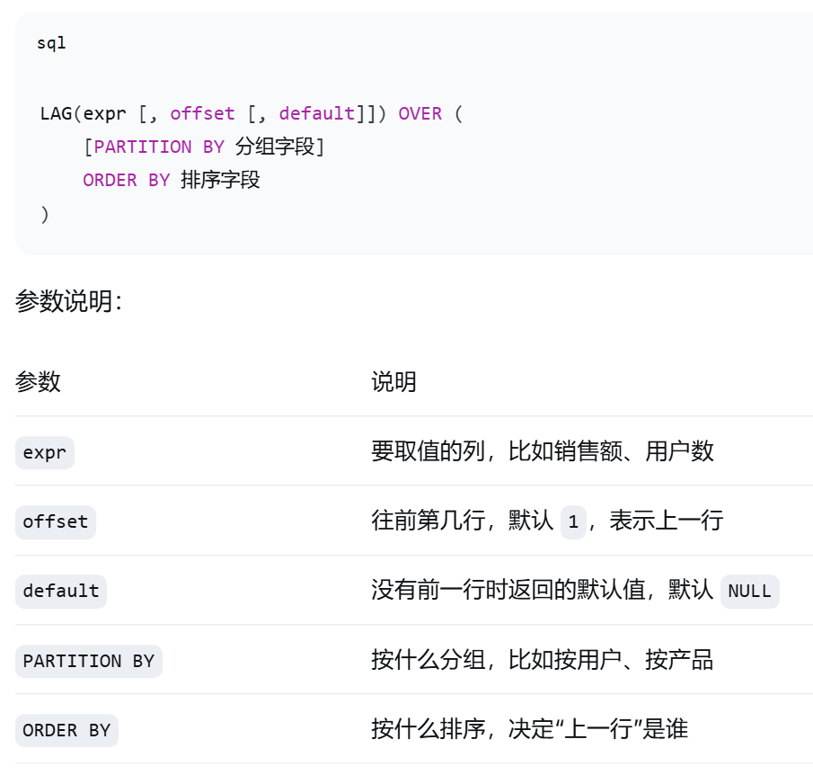

## 一般问题

1.项目里最困难的部分是什么，怎么解决的

2.新增用户次日留存率下降，你怎么分析？

3.辛普森悖论：搜索广告场景，男、女用户的点击率都下降，但整体点击率上升，可能是什么原因？

4.维度指标：如何评估一个行业广告主对百度搜索广告的价值？

5.AB测试的原理

6.写提示词的技巧

角色、任务目标、可用参考资料、过程约束（比如字数等）、输出的结构要求

7.sql的执行顺序

from、join--where--group by--having-select--order by--limit、offset

`LIMIT` 和 `OFFSET` 通常一起用于 **分页查询** ，但职责不同：

* **LIMIT** ：限制本次查询返回多少行。
* **OFFSET** ：跳过前面多少行，从第几行开始返回。

**eg:**

SELECT *
FROM table_name
ORDER BY id
LIMIT 10 OFFSET 20;

按 `id` 排序， **跳过前 20 行，返回接下来的 10 行** 。

## SQL题

1.用户使用记录表（user_id、会话开始时间(time)、功能模块(func) ），获取每个用户当天首次使用AI产品会话所属的功能模块。

select user_id,  date(time), time(time), func

from(

select user_id,date(time),time(time),func, row_number() over(partition by user_id,date(time) order by time(time)) rank

from tab

) t

where rank=1;

2.找出每个产品在2023年每个月的销售金额，并计算每个月的环比增长率（即当前月相对于上个月的增长率）

with b as(

select product_id,sale_year,sale_month, sum_amount,lag(sum_amount)  over(partition by product_id order by sale_year,sale_month) pre_month

from(

select product_id,sale_year,sale_month,sum(month_amount) sum_amount

from tab

where (sale_year="2023") or (sale_year = "2022" AND sale_month = "12")

group by product_id,sale_year,sale_month

) a )

select product_id,sale_year,sale_month, sum_amount,  concat(round((sum_amount-pre_month)*100/nullif(pre_month,0),3),"%") mom_rate

from b

where sale_year="2023";

