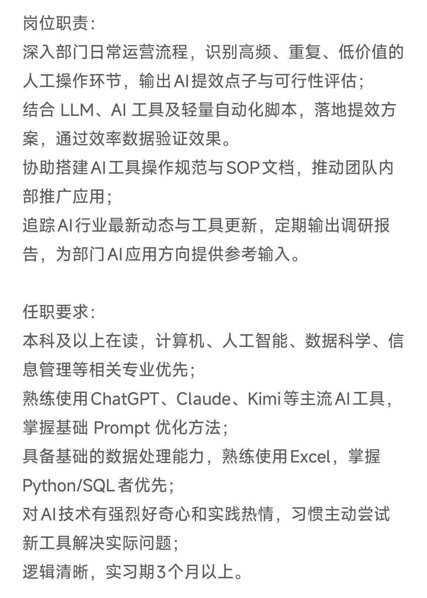

## 智慧互通科技股份有限公司准备阶段

#### 岗位：产品经理实习生

#### 面试时间：2026.9.10

#### 自我介绍:

面试官您好，我目前是西北大学应用统计硕士在读，研究方向主要是时间序列和深度学习。相比纯算法研究，我个人更希望往 AI、互联网产品经理方向发展。我之前在美林数据实习，主要参与了一个面向工程企业的智能化平台项目这个过程中我参与比较多的是 ToB 场景下的需求分析和产品落地。比如针对企业业务，我需要先梳理文档资料结构化入库、数据统计和辅助决策等核心场景，再进一步明确工程文档体量大、格式不规范、知识分散等痛点，并参与设计文档接入、内容解析、知识检索和智能问答等产品方案。这段经历让我比较熟悉从业务场景理解、需求拆解，到方案设计，再到和研发沟通落地的整个过程。同时因为我本身是统计和数据背景，所以除了功能设计之外，我也比较关注数据层面的可行性，包括数据 Schema、SQL 验证和效果分析。除了实习以外，我自己还利用codex从 0 到 1 做过一个数学建模智能体。这个项目我实际上也是按照产品思路完成了需求拆解、功能设计和整体工作流设，并最终做成了可以使用的demo。另外我对用户行为分析、AB测试、竞品分析等有一定了解，所以我在数据分析和通过数据支持产品决策方面也比较熟悉。我看到这个岗位主要涉及AIoT平台的需求调研、产品文档、功能设计以及项目落地，这些工作内容跟我之前做 ToB 产品需求分析的能力比较匹配。智慧交通和物联网也是我十分感兴趣进的领域，所以也希望有机会在实际业务场景中，把我的数据和AI背景结合到平台产品设计中。

#### 面试问题

##### 1. TOC 业务有什么特点？需要注意什么？

##### 核心特点

**用户规模大、决策链路短。**
C 端用户数量通常远大于 B 端，单个用户决策轻、切换成本低，产品需要靠体验和价值主张快速留住人，而不是靠客户关系或合同绑定。

**获客与留存是生命线。**
增长模型高度依赖漏斗：曝光 → 注册 → 激活 → 留存 → 付费/转化。任何一环掉链子都会放大到全局。我在用户行为分析项目里就体会过：加购到购买转化率能到 20.51%，但整体购买转化率只有 1.04%，说明瓶颈在推荐精准度，而不是成交环节——**必须先定位漏斗瓶颈，再决定做什么功能**。

**需求分散、反馈噪声大。**
用户不会像 B 端客户一样写需求文档，更多是吐槽、流失数据、应用商店差评。产品需要从行为数据和用户反馈中抽象出共性需求，而不是被个别声音带跑。

**体验门槛高、容错低。**
C 端用户几乎没有学习成本的耐心，交互卡顿、加载慢、流程绕都会直接导致流失。B 端可以培训、可以客成跟进，C 端只能靠产品自己说话。

**数据驱动决策是刚需。**
因为用户量大，A/B 测试、漏斗分析、留存曲线、LTV/CAC 等指标体系几乎是标配。没有数据支撑的「我觉得」在 C 端非常危险。

##### 需要注意什么

1. **不要把 B 端思维直接套到 C 端。**我实习时做的是面向工程企业的智能化平台，需求来自明确客户、场景可调研、价值可量化。C 端相反：用户画像模糊、需求碎片化、要靠数据和用户研究去验证。
2. 警惕「伪需求」和「自嗨功能」。用户说想要的，和真正能改变行为的，往往不是一回事。要用数据验证假设，小步快跑上线 MVP，而不是憋大招。
3. 关注北极星指标，避免局部优化。例如只优化注册转化，可能带来大量低质量用户，反而拉低留存。要始终对齐核心业务目标。
4. 合规与隐私红线。C 端涉及大量个人数据，采集、使用、推荐都需要符合相关法规，这是产品设计时的硬约束。
5. **冷启动与网络效应。**
   很多 C 端产品（社区、双边市场）有网络效应，早期策略和成熟期完全不同，要分阶段设计。

---

##### 2. 要开发一个功能，如何和开发部门协调？

##### ① 需求阶段：对齐目标，而不是丢需求

- 先和业务方/客户把**问题定义清楚**：解决什么场景、成功标准是什么、优先级多高。
- 写 PRD 时明确：**用户故事、验收标准、边界条件、异常流程**，避免开发过程中反复追问。
- 复杂功能会拉上研发、测试一起做需求评审，提前暴露技术可行性和工期风险。

##### ② 排期阶段：共同承诺，而非单向下达

- 了解研发当前负载和依赖（其他项目、技术债、第三方接口）。
- 把大需求拆成可分期交付的里程碑（MVP → 迭代），而不是一次要「完整版」。
- 对工期有分歧时，用优先级和价值换范围，而不是硬压时间。

##### ③ 开发阶段：保持同步，及时决策

- 固定同步机制：每日站会或隔日进度同步，关注阻塞点而不是 micromanage。
- 需求变更走正式流程：评估影响范围、工期、是否进当前迭代，避免「顺手改一下」。
- 我实习时会参与样例验证和范式构建，和算法/开发一起对齐解析策略、评测口径，**用可复现的样例说话**，比口头描述高效得多。

##### ④ 验收阶段：按标准验收，闭环反馈

- 对照验收标准逐条检查，结合真实业务场景做验收（不只是 happy path）。
- 上线后跟踪核心指标和典型场景问题，形成「需求 → 开发 → 数据反馈 → 优化」闭环。

##### 关键原则

- **用数据和样例沟通，少用形容词。**「效果不好」不如「这批 20 份复杂文档，字段抽取准确率只有 65%，目标是 85%」。
- **提前暴露风险，比事后救火有价值。** 技术债、依赖、第三方不稳定，都要在排期前对齐。

---

##### 3. 为什么想做产品经理？

##### 从能力结构看

我的背景是**应用统计 + 数据分析**，擅长从数据里定位问题、拆解指标。比如在用户行为分析项目里，我把「提升成交效率」拆成流量规律、转化漏斗、用户复购三大命题，最终定位到推荐精准度问题并输出策略清单。这种**问题定义 → 数据分析 → 策略输出**的闭环，和产品经理的核心工作方式高度一致。

##### 从实习验证看

在美林数据做智能化平台实习时，我完整参与了需求分析、产品设计、协调推进、开发测试：

- 把业务需求拆解为文档解析、结构化入库、智能问答三大产品模块；
- 设计数据库 Schema 与业务规则，为知识检索和自然语言问答建立数据基础；
- 协同项目团队对齐需求口径，推动需求反馈与方案优化闭环。

这段经历让我确认：**我享受也适合「定义问题、设计方案、推动落地」这条链路**，而不仅是写代码或做分析本身。

##### 从长期方向看

我关注 LLM / RAG / Agent 等新技术的产品化落地（MMAgent 平台就是我在这方面的实践）。产品经理是把技术能力转化为用户价值的关键角色——**我既懂数据和技术边界，又愿意站在用户和业务视角做取舍**，这是我选择产品经理的核心原因。

> 可根据面试公司业务补一句：「贵司在 XX 领域的产品方向，和我在数据分析 / 智能化产品上的积累非常匹配，希望能在真实业务场景里继续成长。」

---

##### 4. 项目最大的困难是什么？怎么克服的？

##### 困难

在美林数据做智能化平台时，最难的一环是**从复杂、大量、不规范的业务文档中抽取结构化表格**。

难在三点：文档来源杂（扫描件、跨页、合并单元格）；字段名不统一、术语密集；而且抽错会直接污染入库和后续问答，业务无法接受。一开始也没有明确的「什么算抽对」标准，容易和算法陷入无限调参。

##### 怎么克服

我的核心动作是：**把不可控的技术问题，变成可定义、可验收的产品问题。**

1. **拆问题**：把「难抽」拆成格式、语义、质量三类，分别对应预处理、业务词典、评测复核，变成可排期的模块。
2. **定标准**：筛高难度样例做黄金测试集，和业务、算法对齐字段级验收口径（哪些必须准、哪些允许别名、哪些转人工），沉淀为范式模板。
3. **设兜底**：高置信自动入库，低置信进人工确认队列，修正结果回流——ToB 场景「可控」比「全自动」更重要。
4. **建闭环**：按字段统计准确率，定期归因 bad case，驱动解析策略和词典迭代。

##### 收获

抽取能力从「说不清哪里不对」变成**可度量、可分工、可验收**。我也形成了一套习惯：面对技术难题，产品先定义问题和验收标准，用样例和数据说话，而不是直接把需求丢给算法。

---

## 爱回收

#### 岗位：AI产品运营实习生

#### 面试时间：2026.9.14

#### 自我介绍：

面试官您好，我目前是西北大学应用统计专业硕士在读。主修课程主要有：深度学习、科学计算与软件、数据库系统与原理以及综合案例分析与专业文本写作等，看到岗位职责后我觉得匹配度比较高，因为我过去的经历基本都围绕"用 AI 工具解决实际业务问题"展开。

上一段在美林数据的实习中，我担任数据智能分析实习生，参与了一个工程企业智能化平台项目。主要参与了梳理核心痛点，需求拆解以及在开发阶段，针对复杂专业文档持续迭代提示词与抽取策略，并参与搭建 RAG 智能问数平台，通过构建评测集、以 SQL 执行准确率验证效果。这段经历让我完整走通了"识别低效环节—设计 AI 方案—数据验证效果"的闭环，和咱们岗位的职责是比较一致的。

此外，我独立开发过 一个数学建模智能体平台，基于 LangGraph 实现，并搭建了带引用溯源的本地知识库，这让我对 LLM、RAG、Agent 的工程化落地有了一定的动手经验。日常我也是 Claude Code、Codex 等 AI 工具的深度用户，习惯遇到重复劳动就先想"能不能用 AI 自动化完成"。

数据能力方面，我也能熟练使用 Python、SQL 和 Excel这些工具，也做过用户行为分析研究案例。我的实习时间可以保证 3 个月以上。谢谢！

#### 面试问题：

##### 1.为什么把项目拆解为：文档接入—内容解析—结构化抽取—智能问答这几个环节？
