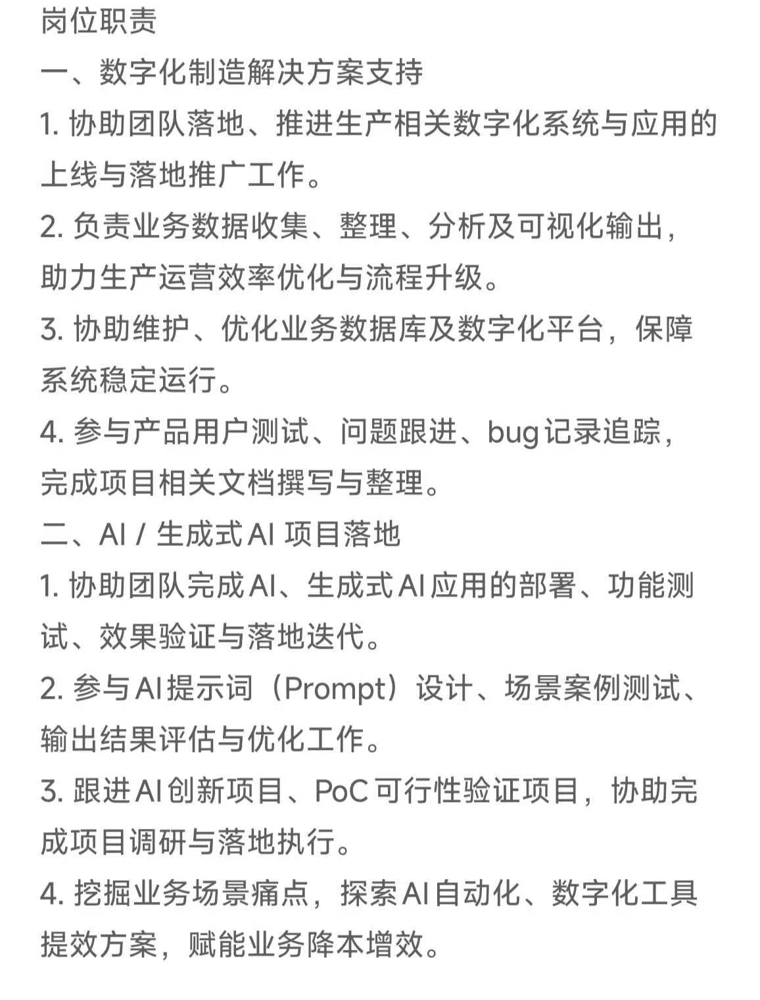
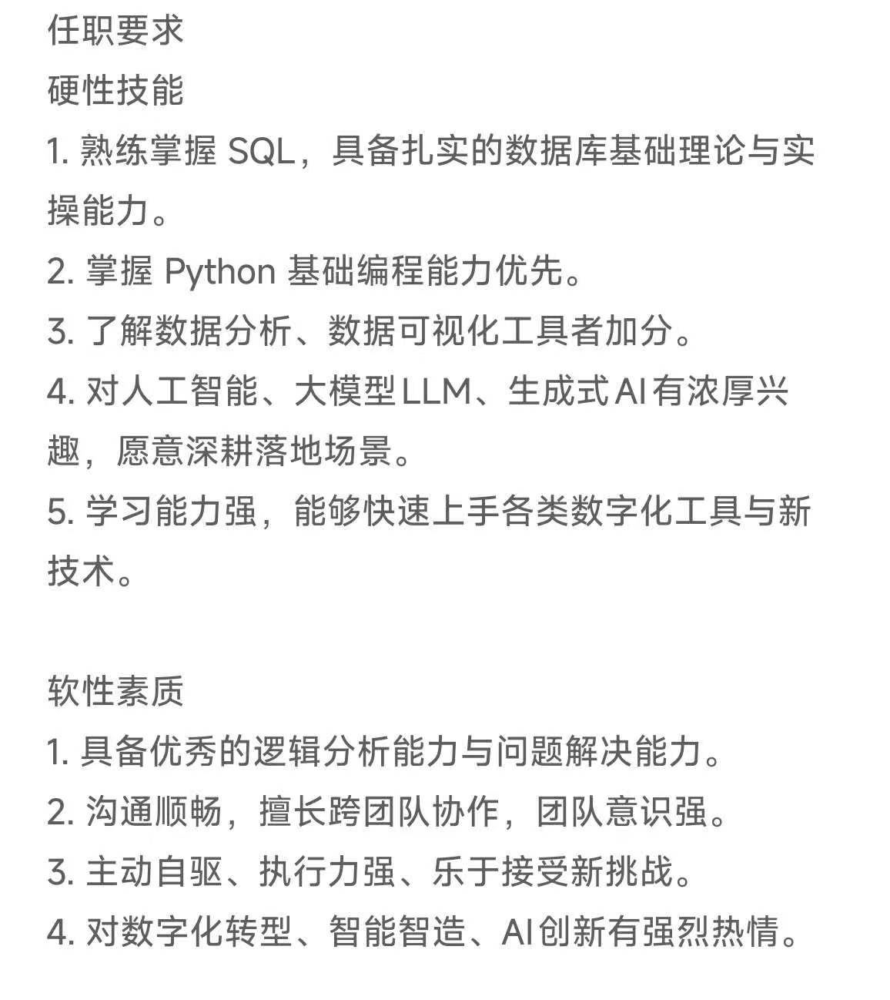

# 施耐德（北京）

#### 面试时间：2026.9.22

### 岗位：数据分析师-AI+Data

### 自我介绍：

面试官您好！我叫何涛，西北大学应用统计专业的硕士研究生。很荣幸有机会参加该岗位的面试。下面我从实习、项目和AI能力三个方面做一个简单的介绍。

一、实习经历｜约40秒

今年暑期我在美林数据做了三个月数据智能分析实习：对接业务部门，围绕质量、经费、安全这些业务领域，设计指标体系，构建结构化数据库，同时用SQL完成多源数据的抽取、清洗与汇总入库，搭建全链路分析数据模型，并输出设计文档；再用BI工具搭建项目管理看板，支撑管理人员实时掌握关键指标。

二、项目经历｜约35秒

一个是西北地区碳排放预测。基于西北五省二十多年的多源排放数据，融合空间信息和Transformer架构搭建预测模型，最终精度较基准模型提升明显，并据此提出分省差异化减排方案。另一个是基于1200万条用户日志数据的用户行为分析，主要从用户行为规律、用户偏好、用户消费规律三个角度分析，输出访问规律、转化漏斗和复购周期等结论。两个项目都走通了“问题定义—数据分析—策略输出”的完整闭环。

三、AI应用能力｜约25秒

AI方面，我日常深度使用Claude Code、Codex。在实习过程中我也深度参与过Prompt优化，也做过Skill设计和Agent的搭建。

收尾｜约10秒

这个岗位把数字化制造和AI结合起来，正是我感兴趣同时也契合当前的发展趋势，希望能有机会加入团队，在真实业务场景中创造价值。谢谢！

### 面试问题：

#### 1.简述Transformer的原理

#### 2.西北碳排放预测模型的工作流

#### 3.常见的CNN时间序列预测模型

#### 4.拿到数据的处理步骤

#### 5.常用的数据库；有没有部署的实践经历

# 百度
### 岗位：海外产品实习生（偏数据分析）
### 时间：2026.9.24
### 面试问题：
#### 1.短视频或者广告投放不同海外平台该怎么埋点
#### 2.你做过和数据分析最相关的项目，以及遇到的困难及怎么处理的
#### 3.我要投入广告费和买用户，要考虑ROI，该怎么设计看板来让业务方更好理解当前的情况
